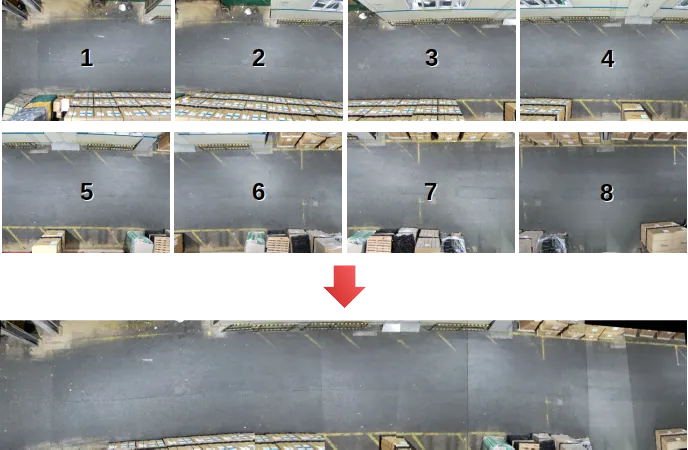

# Multi-camera image Stitching

인접한 여러 대의 카메라로 촬영한 이미지를 연결하여 파노라마 이미지를 생성하는 Multi-camera image Stitching 코드입니다.



- Multi-camera image를 입력
- 인접한 이미지의 매칭점을 불러옴
- 이미지 쌍 간의 호모그래피를 계산
- 알파 블렌딩으로 자연스러운 파노라마 이미지 생성

## Requirements

Python 3.8
OpenCV 4.10.0
PyTorch 2.1.0
NumPy 1.24.3

## Usage
1. `input_data` 폴더에 각 카메라의 이미지셋을 넣습니다. 
    
    ```
    multicam_stitching
     |-input_data : 1~8번 카메라의 png 이미지
     | |- 01
     | | |- 000000.png
     | | |- 000001.png
     | | |- 000002.png
     | | |-     ：
     
     | |- 02
     | | |- 000000.png
     | | |- 000001.png
     | | |- 000002.png
     | | |-     ：
     
          ：
          ：
     
     | |- 08
     | | |- 000000.png
     | | |- 000001.png
     | | |- 000002.png
     | | |-     ：
    ```
    
2. multi2pano_stitch.py 코드를 실행하여 파노라마를 생성합니다.
3. 생성된 파노라마 이미지는 `panorama` 폴더에 저장됩니다.
